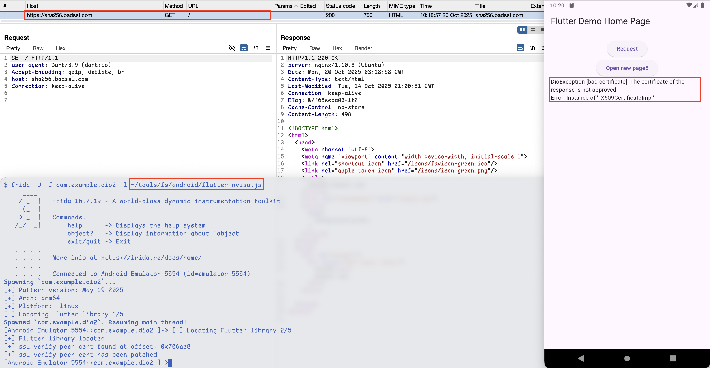
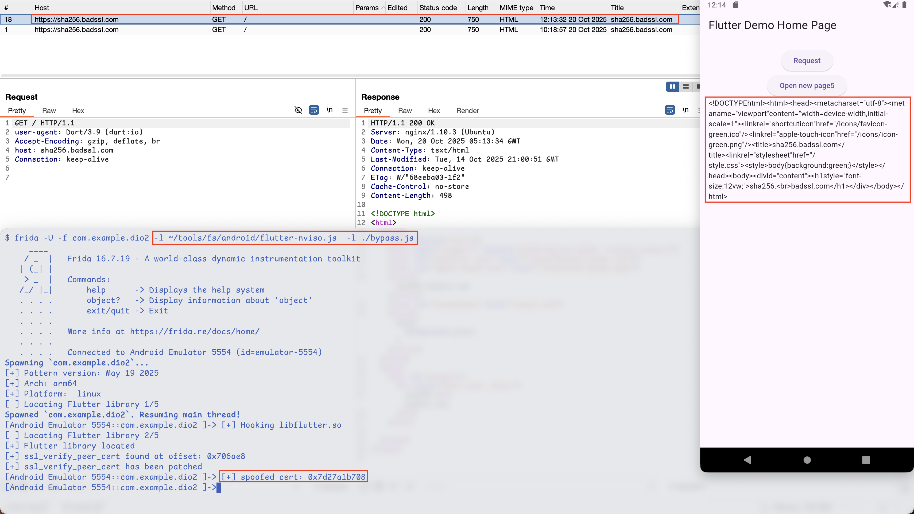

# Flutter dio `ValidateCertificate` Pinning Bypass

<div class="hidden">
    <details>
        <summary>Keywords</summary>
          flutter, dio, ssl pinning, frida
    </details>
</div>

Have you ever wondered why your usual Flutter SSL Pinning bypass is not working
on application built using [`dio`](https://github.com/cfug/dio/)? During one of
my mobile penetration testing project, I was met with such application where the
HTTPS requests were successfully sent to my proxy (using <https://github.com/NVISOsecurity/disable-flutter-tls-verification>) but the mobile application
would throw error messages, stating something went wrong.



As can be seen from the image, there was an exception thrown by `dio` stating that
`The certificate of the response is not approved.`. This error message could also
be observed from `logcat`.

Below is a simple PoC on how the source implementing certificate pinning may look like.

```dart
import 'dart:io';

import 'package:crypto/crypto.dart';

import 'log.dart';
import 'package:dio/dio.dart';
import 'package:dio/io.dart';

// openssl s_client -connect pinning-test.badssl.com:443 < /dev/null 2>/dev/null | openssl x509 -noout -fingerprint -sha256
final fingerprint =
    '8c4d19c0dff0d445de54cf5af25130dd49dc1b3ef2942af71f19f8556e955a2c';

final dio = Dio()
  ..httpClientAdapter = IOHttpClientAdapter(
    createHttpClient: () {
      final client = HttpClient(
        context: SecurityContext(withTrustedRoots: false),
      );
      // You can test the intermediate / root cert here. We just ignore it.
      client.badCertificateCallback = (cert, host, port) => true;
      return client;
    },
    validateCertificate: (cert, host, port) {
      // Check that the cert fingerprint matches the one we expect
      // We definitely require _some_ certificate
      if (cert == null) {
        return false;
      }
      // Validate it any way you want. Here we only check that
      // the fingerprint matches the OpenSSL SHA256.
      final f = sha256.convert(cert.der).toString();
      log.info(f);
      return fingerprint == f;
    },
  );
```

If we now try to search this error message string on the GitHub source code, we
would end up on this [line of code](https://github.com/cfug/dio/blob/d178ffb671669daea15cd9b998a604d6bdbc94de/dio/lib/src/dio_exception.dart#L155).
Searching further for `DioException.badCertificate` references, we could see that
it is referenced by two files, i.e., [`dio/lib/src/adapters/io_adapter.dart`](https://github.com/cfug/dio/blob/d178ffb671669daea15cd9b998a604d6bdbc94de/dio/lib/src/adapters/io_adapter.dart#L186)
and [`plugins/http2_adapter/lib/src/connection_manager_imp.dart`](https://github.com/cfug/dio/blob/d178ffb671669daea15cd9b998a604d6bdbc94de/plugins/http2_adapter/lib/src/connection_manager_imp.dart#L123),
but we will focus more on the former.

Turns out that starting from Dio v5.0.0, `ValidateCertificate` mechanism has been added to
handle certificate pinning better[^1] and the first implementation could be found under this [commit](https://github.com/cfug/dio/commit/fcd076ac21b5dc7914d6728e9a1e77d2662bbcff#diff-6b4fbab3f519f98ba0e68fb1039f0069ba2f0fa144c8262ab369e8caf6618956R126)

## Understanding `ValidateCertificate` Implementation

Looking at this [line of code](https://github.com/cfug/dio/blob/d178ffb671669daea15cd9b998a604d6bdbc94de/dio/lib/src/adapters/io_adapter.dart#L181),
we could see that the first argument to `validateCertificate` comes from `responseStream.certificate`,
where `responseStream` is a `HttpClientResponse` object imported from `dart:io`.

```dart
    Future<HttpClientResponse> future = request.close();
    // ...
    final responseStream = await future;

    if (validateCertificate != null) {
      final host = options.uri.host;
      final port = options.uri.port;
      final bool isCertApproved = validateCertificate!(
        responseStream.certificate,
        host,
        port,
      );
      if (!isCertApproved) {
        throw DioException.badCertificate(
          requestOptions: options,
          error: responseStream.certificate,
        );
      }
    }
```

If we dig deeper into the dart SDK, we could see that the `certificate` field
implementation of the `HttpClientResponse` class could be found in this [line of code](https://github.com/dart-lang/sdk/blob/fae8a34f33ac1fc132574359bec60c36d29e932f/sdk/lib/_http/http_impl.dart#L627)

```dart
class _HttpClientResponse extends _HttpInboundMessageListInt
    implements HttpClientResponse {
  // ...
  X509Certificate? get certificate {
    var socket = _httpRequest._httpClientConnection._socket;
    if (socket is SecureSocket) return socket.peerCertificate;
    return null;
  }
  // ...
}
```

Now, we need to look for the `peerCertificate` getter implementation under the [`SecureSocket` class](https://github.com/dart-lang/sdk/blob/fae8a34f33ac1fc132574359bec60c36d29e932f/sdk/lib/io/secure_socket.dart#L10).
We could see the `peerCertificate` declared [here](https://github.com/dart-lang/sdk/blob/fae8a34f33ac1fc132574359bec60c36d29e932f/sdk/lib/io/secure_socket.dart#L226) but with no implementation.
Through some assumption of dart classes inheritance, we could see that the `SecureSocket`
class factory comes from [`RawSecureSocket` class](https://github.com/dart-lang/sdk/blob/fae8a34f33ac1fc132574359bec60c36d29e932f/sdk/lib/io/secure_socket.dart#L259).
Coincidentally, all of `SecureSocket` class methods call `RawSecureSocket` methods, which leads us to `RawSecureSocket` class to be analyzed next.
Similar to previous case, `RawSecureSocket`'s `peerCertificate` [field](https://github.com/dart-lang/sdk/blob/fae8a34f33ac1fc132574359bec60c36d29e932f/sdk/lib/io/secure_socket.dart#L489) has no implementation defined
and using the same logic, `RawSecureSocket` class methods heavily depends on `_RawSecureSocket` class methods which leads us to
the `peerCertificate` [field](https://github.com/dart-lang/sdk/blob/fae8a34f33ac1fc132574359bec60c36d29e932f/sdk/lib/io/secure_socket.dart#L916) with implementation defined.

```dart
  X509Certificate? get peerCertificate => _secureFilter!.peerCertificate;
```

The `_SecureFilter` class is an abstract class which has corresponding patches
according to the platform where the code is compiled, i.e., vm, wasm, and js.
This `_SecureFilter` class is not suppported under wasm and js as can be referred from these line of codes:
- <https://github.com/dart-lang/sdk/blob/fae8a34f33ac1fc132574359bec60c36d29e932f/sdk/lib/_internal/wasm/lib/io_patch.dart#L667>
- <https://github.com/dart-lang/sdk/blob/fae8a34f33ac1fc132574359bec60c36d29e932f/sdk/lib/_internal/js_runtime/lib/io_patch.dart#L667>

This only leaves us with one option left, vm, which is the platform used on Android application.
Turns out that the `_SecureFilter` class factory depends on [`_SecureFilterImpl`](https://github.com/dart-lang/sdk/blob/fae8a34f33ac1fc132574359bec60c36d29e932f/sdk/lib/_internal/vm/bin/secure_socket_patch.dart#L16)
and looking at this final class leads us to this [line of code](https://github.com/dart-lang/sdk/blob/fae8a34f33ac1fc132574359bec60c36d29e932f/sdk/lib/_internal/vm/bin/secure_socket_patch.dart#L171)

```dart
@pragma("vm:entry-point")
base class _SecureFilterImpl extends NativeFieldWrapperClass1
    implements _SecureFilter {
  // ...
  @pragma("vm:external-name", "SecureSocket_PeerCertificate")
  external X509Certificate? get peerCertificate;
  // ...
}
```

Looks like we have reached the end of the dart part of code and is now dealing with native implementation where
the `peerCertificate` getter calls the exported function `SecureSocket_PeerCertificate`.

This native function implementation could be found on this [line of code](https://github.com/dart-lang/sdk/blob/fae8a34f33ac1fc132574359bec60c36d29e932f/runtime/bin/secure_socket_filter.cc#L203),
which eventually calls [`SSLFilter::PeerCertificate`](https://github.com/dart-lang/sdk/blob/fae8a34f33ac1fc132574359bec60c36d29e932f/runtime/bin/secure_socket_filter.cc#L453)

```cpp
#include <openssl/bio.h>
#include <openssl/ssl.h>
#include <openssl/x509.h>

// ...

void FUNCTION_NAME(SecureSocket_PeerCertificate)(Dart_NativeArguments args) {
  Dart_Handle cert = ThrowIfError(GetFilter(args)->PeerCertificate());
  Dart_SetReturnValue(args, cert);
}


Dart_Handle SSLFilter::PeerCertificate() {
  X509* ca = SSL_get_peer_certificate(ssl_);
  if (ca == nullptr) {
    return Dart_Null();
  }
  return X509Helper::WrappedX509Certificate(ca);
}
```

Now we know that the certificate being validated comes from `OpenSSL`'s `SSL_get_peer_certificate` function
which is then wrapped into a dart object.

[^1]: <https://github.com/cfug/dio/commit/fcd076ac21b5dc7914d6728e9a1e77d2662bbcff#diff-1963e2198227f419911aa532474ea0937e32cd9a75d760c279dc0605ade30237R4>

## Hooking `X509Helper::WrappedX509Certificate`

Our plan to bypass this `validateCertificate` check is to hook the first argument
of `X509Helper::WrappedX509Certificate` and replace it with the actual server
certificate, instead of our proxy certificate.

To achieve this we would need to initialize a OpenSSL `X509` object. Since the
OpenSSL library is linked statically to the `libflutter.so`, it would be pretty
hard to get the functions that we need to initialize `X509` object with no exported
symbol.

### Creating X509 Object in Frida

The workaround for this is to simply put our own OpenSSL shared libraries on the
victim application internal storage and use Frida to load the libraries like so.

```js
Module.load("/data/data/com.example.app/libssl_X.so");
Module.load("/data/data/com.example.app/libcrypto_X.so");
```

Luckily, we could obtain these shared libraries compiled for Android from this
amazing [GitHub repository](https://github.com/KDAB/android_openssl)

Besides the shared library, we would also need to put the actual server PEM on
the application internal storage to avoid any permission issue when reading using Frida.

The code snippet below is responsible for instantiating a `X509` object.

```js
const packagePath = "/data/data/com.example.dio2";
const ori_pem_path = `${packagePath}/ori.pem`;

const f = new File(ori_pem_path, "w");

// openssl s_client -connect sha256.badssl.com:443 </dev/null 2>/dev/null | openssl x509 -outform pem
const ori_pem = `
-----BEGIN CERTIFICATE-----
MIIE/jCCA+agAwIBAgISBr+A1EXHT8084rg9trKZyMpPMA0GCSqGSIb3DQEBCwUA
MDMxCzAJBgNVBAYTAlVTMRYwFAYDVQQKEw1MZXQncyBFbmNyeXB0MQwwCgYDVQQD
EwNSMTIwHhcNMjUwOTE2MjAwMjQ4WhcNMjUxMjE1MjAwMjQ3WjAXMRUwEwYDVQQD
DAwqLmJhZHNzbC5jb20wggEiMA0GCSqGSIb3DQEBAQUAA4IBDwAwggEKAoIBAQCY
pBQTh6FQcZumc3LX3+U46TRpDnc84V0bukDXJzcoleMqInOWvIoZsQiXaYgIWrZW
ETafFEGpS5hc3/RM4Ydz+2kuQQ+LJAHT7bk2Zc7aHo/7QhjGjL/jBGusJqRUzo/5
n8bdiXsGmhsMCvSm+L2bG1i6JB8AJE5agFiExniFYHZUC9u8jhhFiW+nOwvIyXIa
75UrRjpXaF8LqIKYipUigq4hBtEE2Lsz73jy803qdGHJVDEO+ZCoks+wHwfEWeE4
5E1g64/4iactQqK1gt3G6+ti7faWflsghA/FUQBtAzOniyTP5X0L/Mp6RXaY9Y7t
Cctx/Ktrf3lRh7ME9DFRAgMBAAGjggImMIICIjAOBgNVHQ8BAf8EBAMCBaAwHQYD
VR0lBBYwFAYIKwYBBQUHAwEGCCsGAQUFBwMCMAwGA1UdEwEB/wQCMAAwHQYDVR0O
BBYEFLpQqK9k0LU7mvulqennC7g1m913MB8GA1UdIwQYMBaAFAC1KfItjm8x6JtM
rXg++tzpDNHSMDMGCCsGAQUFBwEBBCcwJTAjBggrBgEFBQcwAoYXaHR0cDovL3Ix
Mi5pLmxlbmNyLm9yZy8wIwYDVR0RBBwwGoIMKi5iYWRzc2wuY29tggpiYWRzc2wu
Y29tMBMGA1UdIAQMMAowCAYGZ4EMAQIBMC4GA1UdHwQnMCUwI6AhoB+GHWh0dHA6
Ly9yMTIuYy5sZW5jci5vcmcvODAuY3JsMIIBAgYKKwYBBAHWeQIEAgSB8wSB8ADu
AHUADeHyMCvTDcFAYhIJ6lUu/Ed0fLHX6TDvDkIetH5OqjQAAAGZVFT2nwAABAMA
RjBEAiAEYGW5bBUnnWw+n8AnjcXNwUCXIaBfzlJx/hM0Qu+L9QIgPk0Cfw9jH1pf
Ohze0KTnGDl8LVMlJmvZGLFkNfzHjq8AdQAaBP9J0FQdQK/2oMO/8djEZy9O7O4j
QGiYaxdALtyJfQAAAZlUVPbaAAAEAwBGMEQCIAX3e/AXNAhVIeKVtS6JFE8DPbbj
E7WDYLefyj4UnVLMAiAPR8GKllL6585/KMnL24LgOMJksCYrBxKOBUS6U91Z+DAN
BgkqhkiG9w0BAQsFAAOCAQEAKs1kVnPsPxF5He8DOZqu/lN3YPp3vuBEb3lv53uB
eUKYBEH89TgBRb2e9L6S8IBMgvg7YnsvU7+4+D3tWBBBKwqx7yihD+kY57p5cJnU
qCKCMs4HJwyUL2wtuNM17StPzX/C5mAzauebtyLKSLuHLAZGZhex9CAtybR2DMZa
LdI89Azp9bcDG8JaRcpkysIcbNr3+Hzy5+SWPwu1vOiKikAY5ysmbLbAMbnJSuMV
MzxpZ4mKv1PiYU2mfLkB7eqBzBZeZGcjkQwOjXFpah1+PRIwUfzB6Mt476ySuHcc
rrqw9GOHx+NIeoCgpa8dY8iXH6zX8m7bkstvZimEEE8nCw==
-----END CERTIFICATE-----
`;
f.write(ori_pem);
f.close();

// const ver = "1_1";
const ver = "3";

// https://github.com/KDAB/android_openssl/tree/master/ssl_1.1/arm64-v8a
// use adb push to upload the so files to `packagePath`
const libcrypto = Module.load(`${packagePath}/libcrypto_${ver}.so`);
const libssl = Module.load(`${packagePath}/libssl_${ver}.so`);

const ori_pem_cstr = Memory.allocUtf8String(ori_pem_path);
const perm_cstr = Memory.allocUtf8String("r");
const fopen = new NativeFunction(
	Module.getExportByName(null, "fopen"),
	"pointer",
	["pointer", "pointer"],
);
const fclose = new NativeFunction(
	Module.getExportByName(null, "fclose"),
	"pointer",
	["pointer"],
);
const PEM_read_X509 = new NativeFunction(
	Module.getExportByName(null, "PEM_read_X509"),
	"pointer",
	["pointer", "int", "int", "int"],
);
const X509_free = new NativeFunction(
	Module.getExportByName(null, "X509_free"),
	"pointer",
	["pointer"],
);

const fp = fopen(ori_pem_cstr, perm_cstr);
const SPOOFED_CERT = PEM_read_X509(fp, 0, 0, 0);
fclose(fp);
```

### Finding `X509Helper::WrappedX509Certificate` Function Address

Since the `SecureSocker_PeerCertificate` is exported, we could find this string
on Ghidra and use that as a starting point.

```
                         s_SecureSocket_PeerCertificate_002a4366   XREF[1]:   00b92618(*)
      002a4366 53 65 63      ds        "SecureSocket_PeerCertificate"
               75 72 65
               53 6f 63
```

This string is referenced on `0x0b92618` and if we look into this address, we
could find the function address just 8 bytes below the XREF, i.e., `FUN_00944e08`

```
      00b92618 66 43 2a      addr      s_SecureSocket_PeerCertificate_002a4366    = "SecureSocket_PeerCertific
               00 00 00
               00 00
      00b92620 08 4e 94      addr      FUN_00944e08
               00 00 00
               00 00
```

The decompilation output of this function looks like so.

```c
void FUN_00944e08(undefined8 param_1)
{
  uint uVar1;
  long lVar2;
  undefined8 uVar3;
  long *plVar4;
  ulong uVar5;
  long lVar6;

  lVar2 = FUN_00940de0();
  uVar3 = DAT_00bc3720;
  if (*(long *)(lVar2 + 0x18) != 0) {
    lVar2 = *(long *)(*(long *)(lVar2 + 0x18) + 0x30);
    lVar6 = *(long *)(lVar2 + 0x1d0);
    if (lVar6 == 0) {
      plVar4 = *(long **)(lVar2 + 0x118);
      lVar6 = plVar4[0xf5];
      if (((lVar6 == 0) && (lVar6 = plVar4[0xf4], lVar6 == 0)) &&
         (lVar6 = *(long *)(*plVar4 + 0x58), lVar6 == 0)) goto LAB_00944ea8;
    }
    lVar2 = *(long *)(lVar6 + 0x98);
    if (lVar2 != 0) {
      uVar5 = *(ulong *)(lVar2 + 0x18);
      uVar1 = (uint)uVar5;
      while ((uVar1 != 0xffffffff &&
             (uVar1 = FUN_00570340(uVar5 & 0xffffffff,(uint)uVar5 + 1,lVar2 + 0x18),
             uVar1 != (uint)uVar5))) {
        uVar5 = (ulong)uVar1;
      }
      uVar3 = DAT_00bc3720;
      if (*(long *)(lVar6 + 0x98) != 0) {
        uVar3 = FUN_009463c8();
      }
    }
  }
LAB_00944ea8:
  uVar5 = FUN_00adea50(uVar3);
  if ((uVar5 & 1) == 0) {
    FUN_00af6ee8(param_1,uVar3);
    return;
  }
                    /* WARNING: Subroutine does not return */
  FUN_00ae1090(uVar3);
}
```

Looking into `FUN_009463c8` we could see that there is a reference to the string `X509Certificate`,
which hints us that this is the `X509Helper::WrappedX509Certificate` function.
Furthermore, if we look into `FUN_007ff1b8` we could see that it eventually calls
`OPENSSL_memory_free` which reveals to us that this must be `X509_free` (spoiler:
we need this function address later to prevent the app from crashing)

```c
undefined8 FUN_009463c8(long param_1)
{
  uint uVar1;
  undefined8 uVar2;
  undefined8 uVar3;
  ulong uVar4;
  undefined8 local_28;

  uVar2 = DAT_00bc3720;
  if (param_1 != 0) {
    FUN_00aebd30("dart:io",7);
    uVar2 = FUN_00af9384();
    uVar3 = FUN_00aebd30("X509Certificate",0xf);
    uVar2 = FUN_00af84d8(uVar2,uVar3);
    uVar4 = FUN_00adea50();
    if ((uVar4 & 1) == 0) {
      local_28 = 0;
      uVar3 = FUN_00aebd30("_",1);
      uVar2 = FUN_00af2ecc(uVar2,uVar3,0,&local_28);
      uVar4 = FUN_00adea50();
      if ((uVar4 & 1) == 0) {
        uVar3 = FUN_00af6290(uVar2,param_1);
        uVar4 = FUN_00adea50();
        if ((uVar4 & 1) != 0) {
          FUN_007ff1b8(param_1);
          return uVar3;
        }
        uVar1 = FUN_007ff4a4(param_1,0);
        FUN_00ae2820(uVar2,param_1,(uVar1 & ((int)uVar1 >> 0x1f ^ 0xffffffffU)) + 0x200,FUN_00816834
                    );
        return uVar2;
      }
    }
    FUN_007ff1b8(param_1);
  }
  return uVar2;
}
```

After some light reverse engineering with the aid of the original source code
we would get this kind of code, where:

- `FUN_009463c8` is `X509Helper::WrappedCertificate`
- `FUN_007ff1b8` is `X509_free`

```c
void SecureSocket_PeerCertificate(undefined8 param_1)
{
  uint uVar1;
  long sslfilter;
  undefined8 uVar2;
  long *plVar3;
  ulong uVar4;
  long lVar5;

  sslfilter = GetFilter();
  uVar2 = DAT_00bc3720;
  if (*(long *)(sslfilter + 0x18) != 0) {
    sslfilter = *(long *)(*(long *)(sslfilter + 0x18) + 0x30);
    lVar5 = *(long *)(sslfilter + 0x1d0);
    if (lVar5 == 0) {
      plVar3 = *(long **)(sslfilter + 0x118);
      lVar5 = plVar3[0xf5];
      if (((lVar5 == 0) && (lVar5 = plVar3[0xf4], lVar5 == 0)) &&
         (lVar5 = *(long *)(*plVar3 + 0x58), lVar5 == 0)) goto LAB_00944ea8;
    }
    sslfilter = *(long *)(lVar5 + 0x98);
    if (sslfilter != 0) {
      uVar4 = *(ulong *)(sslfilter + 0x18);
      uVar1 = (uint)uVar4;
      while ((uVar1 != 0xffffffff &&
             (uVar1 = FUN_00570340(uVar4 & 0xffffffff,(uint)uVar4 + 1,sslfilter + 0x18),
             uVar1 != (uint)uVar4))) {
        uVar4 = (ulong)uVar1;
      }
      uVar2 = DAT_00bc3720;
      if (*(long *)(lVar5 + 0x98) != 0) {
        uVar2 = X509Helper::WrappedX509Certificate();
      }
    }
  }
LAB_00944ea8:
  uVar4 = FUN_00adea50(uVar2);
  if ((uVar4 & 1) == 0) {
    Dart_SetReturnValue(param_1,uVar2);
    return;
  }
                    /* WARNING: Subroutine does not return */
  FUN_00ae1090(uVar2);
}

undefined8 X509Helper::WrappedX509Certificate(long certificate)
{
  uint uVar1;
  undefined8 uVar2;
  undefined8 uVar3;
  ulong uVar4;
  undefined8 local_28;
  uVar2 = DAT_00bc3720;
  if (certificate != 0) {
    DartUtils::NewString("dart:io",7);
    uVar2 = Dart_LookupLibrary();
    uVar3 = DartUtils::NewString("X509Certificate",0xf);
    uVar2 = GetTypeCommon(uVar2,uVar3);
    uVar4 = m_mutex_stuff();
    if ((uVar4 & 1) == 0) {
      local_28 = 0;
      uVar3 = DartUtils::NewString("_",1);
      uVar2 = Dart_New(uVar2,uVar3,0,&local_28);
      uVar4 = m_mutex_stuff();
      if ((uVar4 & 1) == 0) {
        uVar3 = Dart_SetNativeInstanceField(uVar2,certificate);
        uVar4 = m_mutex_stuff();
        if ((uVar4 & 1) != 0) {
          X509_free(certificate);
          return uVar3;
        }
        uVar1 = FUN_007ff4a4(certificate,0);
        Dart_NewFinalizableHandle
                  (uVar2,certificate,(uVar1 & ((int)uVar1 >> 0x1f ^ 0xffffffffU)) + 0x200,
                   FUN_00816834);
        return uVar2;
      }
    }
    X509_free(certificate);
  }
  return uVar2;
}
```

Now we got what we needed:

- `X509Helper::WrappedX509Certificate` is at `libflutter_base + 0x008463c8`
- `X509_free` is at `libflutter_base + 0x006ff1b8`

## Final Frida Script

Putting everything together:

```js
const packagePath = "/data/data/com.example.dio2";
const ori_pem_path = `${packagePath}/ori.pem`;

const f = new File(ori_pem_path, "w");

// openssl s_client -connect sha256.badssl.com:443 </dev/null 2>/dev/null | openssl x509 -outform pem
const ori_pem = `
-----BEGIN CERTIFICATE-----
MIIE/jCCA+agAwIBAgISBr+A1EXHT8084rg9trKZyMpPMA0GCSqGSIb3DQEBCwUA
MDMxCzAJBgNVBAYTAlVTMRYwFAYDVQQKEw1MZXQncyBFbmNyeXB0MQwwCgYDVQQD
EwNSMTIwHhcNMjUwOTE2MjAwMjQ4WhcNMjUxMjE1MjAwMjQ3WjAXMRUwEwYDVQQD
DAwqLmJhZHNzbC5jb20wggEiMA0GCSqGSIb3DQEBAQUAA4IBDwAwggEKAoIBAQCY
pBQTh6FQcZumc3LX3+U46TRpDnc84V0bukDXJzcoleMqInOWvIoZsQiXaYgIWrZW
ETafFEGpS5hc3/RM4Ydz+2kuQQ+LJAHT7bk2Zc7aHo/7QhjGjL/jBGusJqRUzo/5
n8bdiXsGmhsMCvSm+L2bG1i6JB8AJE5agFiExniFYHZUC9u8jhhFiW+nOwvIyXIa
75UrRjpXaF8LqIKYipUigq4hBtEE2Lsz73jy803qdGHJVDEO+ZCoks+wHwfEWeE4
5E1g64/4iactQqK1gt3G6+ti7faWflsghA/FUQBtAzOniyTP5X0L/Mp6RXaY9Y7t
Cctx/Ktrf3lRh7ME9DFRAgMBAAGjggImMIICIjAOBgNVHQ8BAf8EBAMCBaAwHQYD
VR0lBBYwFAYIKwYBBQUHAwEGCCsGAQUFBwMCMAwGA1UdEwEB/wQCMAAwHQYDVR0O
BBYEFLpQqK9k0LU7mvulqennC7g1m913MB8GA1UdIwQYMBaAFAC1KfItjm8x6JtM
rXg++tzpDNHSMDMGCCsGAQUFBwEBBCcwJTAjBggrBgEFBQcwAoYXaHR0cDovL3Ix
Mi5pLmxlbmNyLm9yZy8wIwYDVR0RBBwwGoIMKi5iYWRzc2wuY29tggpiYWRzc2wu
Y29tMBMGA1UdIAQMMAowCAYGZ4EMAQIBMC4GA1UdHwQnMCUwI6AhoB+GHWh0dHA6
Ly9yMTIuYy5sZW5jci5vcmcvODAuY3JsMIIBAgYKKwYBBAHWeQIEAgSB8wSB8ADu
AHUADeHyMCvTDcFAYhIJ6lUu/Ed0fLHX6TDvDkIetH5OqjQAAAGZVFT2nwAABAMA
RjBEAiAEYGW5bBUnnWw+n8AnjcXNwUCXIaBfzlJx/hM0Qu+L9QIgPk0Cfw9jH1pf
Ohze0KTnGDl8LVMlJmvZGLFkNfzHjq8AdQAaBP9J0FQdQK/2oMO/8djEZy9O7O4j
QGiYaxdALtyJfQAAAZlUVPbaAAAEAwBGMEQCIAX3e/AXNAhVIeKVtS6JFE8DPbbj
E7WDYLefyj4UnVLMAiAPR8GKllL6585/KMnL24LgOMJksCYrBxKOBUS6U91Z+DAN
BgkqhkiG9w0BAQsFAAOCAQEAKs1kVnPsPxF5He8DOZqu/lN3YPp3vuBEb3lv53uB
eUKYBEH89TgBRb2e9L6S8IBMgvg7YnsvU7+4+D3tWBBBKwqx7yihD+kY57p5cJnU
qCKCMs4HJwyUL2wtuNM17StPzX/C5mAzauebtyLKSLuHLAZGZhex9CAtybR2DMZa
LdI89Azp9bcDG8JaRcpkysIcbNr3+Hzy5+SWPwu1vOiKikAY5ysmbLbAMbnJSuMV
MzxpZ4mKv1PiYU2mfLkB7eqBzBZeZGcjkQwOjXFpah1+PRIwUfzB6Mt476ySuHcc
rrqw9GOHx+NIeoCgpa8dY8iXH6zX8m7bkstvZimEEE8nCw==
-----END CERTIFICATE-----
`;
f.write(ori_pem);
f.close();

/*
 * both openssl v1.1 and v3 work
 */

// const ver = "1_1";
const ver = "3";

// https://github.com/KDAB/android_openssl/tree/master/ssl_1.1/arm64-v8a
// use adb push to upload the so files to `packagePath`
const libcrypto = Module.load(`${packagePath}/libcrypto_${ver}.so`);
const libssl = Module.load(`${packagePath}/libssl_${ver}.so`);

const ori_pem_cstr = Memory.allocUtf8String(ori_pem_path);
const perm_cstr = Memory.allocUtf8String("r");
const fopen = new NativeFunction(
	Module.getExportByName(null, "fopen"),
	"pointer",
	["pointer", "pointer"],
);
const fclose = new NativeFunction(
	Module.getExportByName(null, "fclose"),
	"pointer",
	["pointer"],
);
const PEM_read_X509 = new NativeFunction(
	Module.getExportByName(null, "PEM_read_X509"),
	"pointer",
	["pointer", "int", "int", "int"],
);
const X509_free = new NativeFunction(
	Module.getExportByName(null, "X509_free"),
	"pointer",
	["pointer"],
);

const fp = fopen(ori_pem_cstr, perm_cstr);
const SPOOFED_CERT = PEM_read_X509(fp, 0, 0, 0);
fclose(fp);

function bypass() {
	const libflutter = Process.findModuleByName("libflutter.so");
	if (libflutter === null) {
		return false;
	}
	console.log("[+] Hooking libflutter.so");
	const libflutter_WrappedX509Certificate_addr = libflutter.base.add(0x8463c8);
	const libflutter_X509_free_addr = libflutter.base.add(0x6ff1b8);
	const libflutter_X509_free_ori = new NativeFunction(
		libflutter_X509_free_addr,
		"pointer",
		["pointer"],
	);
	Interceptor.attach(libflutter_WrappedX509Certificate_addr, function () {
		console.log(`[+] spoofed cert: ${SPOOFED_CERT}`);
		this.context.x0 = SPOOFED_CERT;
	});
	Interceptor.replace(
		libflutter_X509_free_addr,
		new NativeCallback(
			(arg) => {
				if (SPOOFED_CERT !== null && arg.sub(SPOOFED_CERT) == 0) {
					return ptr(0);
				}
				return libflutter_X509_free_ori(arg);
			},
			"pointer",
			["pointer"],
		),
	);
	return true;
}

const interval = setInterval(() => {
	if (bypass()) {
		clearInterval(interval);
	}
}, 100);
```

> [!NOTE]
> We need to hook `X509_free` since without this we could observed that the application
> kept crashing while attempting to free our `X509` object
> We know that it is `X509_free` crashing based on the stack trace function address

## Demo

```shell
$ ls lib*
libcrypto_1_1.so  libcrypto_3.so  libssl_1_1.so  libssl_3.so

$ adb push ./lib*.so /data/local/tmp
./libcrypto_1_1.so: 1 file pushed, 0 skipped. 246.9 MB/s (2366824 bytes in 0.009s)
./libcrypto_3.so: 1 file pushed, 0 skipped. 219.0 MB/s (4030424 bytes in 0.018s)
./libssl_1_1.so: 1 file pushed, 0 skipped. 96.4 MB/s (507152 bytes in 0.005s)
./libssl_3.so: 1 file pushed, 0 skipped. 277.9 MB/s (634680 bytes in 0.002s)
4 files pushed, 0 skipped. 167.9 MB/s (7539080 bytes in 0.043s)

$ adb shell

generic_arm64:/ $ su

generic_arm64:/ # cd /data/local/tmp

generic_arm64:/data/local/tmp # ls ./lib*.so
./libcrypto_1_1.so ./libcrypto_3.so ./libssl_1_1.so ./libssl_3.so

generic_arm64:/data/local/tmp # cp ./lib*.so /data/data/com.example.dio2

generic_arm64:/data/local/tmp # ls /data/data/com.example.dio2
app_flutter cache code_cache files libcrypto_1_1.so libcrypto_3.so libssl_1_1.so libssl_3.so
```



## Appendix

### References

- <https://github.com/KDAB/android_openssl>
- <https://github.com/NVISOsecurity/disable-flutter-tls-verification>
